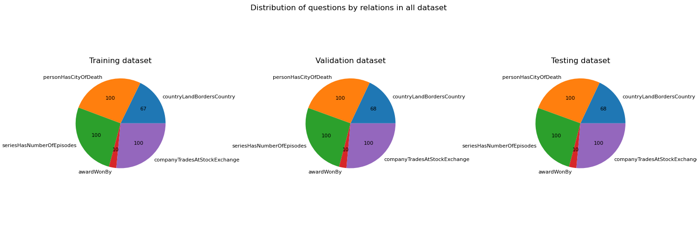
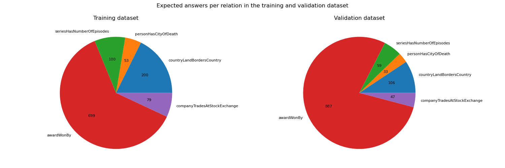

# Knowledge Base Construction

Group project for the **LLM & Structured Data** course at Télécom Paris.

- [Challenge](https://lm-kbc.github.io/challenge2024/)
- [Dataset](https://github.com/lm-kbc/dataset2024)

Clone the project and git submodules:

```bash
git submodule update --init
```

Create and initialize a python environment:

```bash
conda create -n knowledge-base-construction python=3.12.1
conda activate knowledge-base-construction
pip install -r dataset/requirements.txt
```

## Overview

Structure of the `kbc` folder.

```
├── dataset.py  # Dataset loader
│
└── model.py    # LLM wrappers
```

## Access Models

You must first ask for access to MistralAI and LLama models on huggingface:

- https://huggingface.co/meta-llama/Llama-3.2-1B-Instruct
- https://huggingface.co/mistralai/Mistral-7B-Instruct-v0.3

Then generate a huggingface token with read access to gated models:

- https://huggingface.co/settings/tokens

Last, login with the token using huggingface-cli:

```bash
huggingface-cli login
```

## Performance

Test a prediction file against the ground truth:

```bash
python dataset/evaluate.py -g dataset/data/train.jsonl -p predictions.jsonl
```

## Dataset

There are 5 relations in the dataset:

| ID                             | Constraints                 | Description                                                      |
| ------------------------------ | --------------------------- | ---------------------------------------------------------------- |
| _countryLandBordersCountry_    | `list`, can be empty        | Which other countries share a land border with the given country |
| _personHasCityOfDeath_         | Single value, can be `null` | In which city the given person died                              |
| _seriesHasNumberOfEpisodes_    | `int`                       | How many episodes the TV series has                              |
| _awardWonBy_                   | `list`, can be empty        | What people won the given award                                  |
| _companyTradesAtStockExchange_ | `list`, can be empty        | In which stock exchange the given company trades                 |

The dataset is divided into 3. Both the training and validation datasets have the answers:
| Dataset | Questions |
| ---------- | --------- |
| Training | 377 |
| Validation | 378 |
| Testing | 378 |

### Data Repartition




